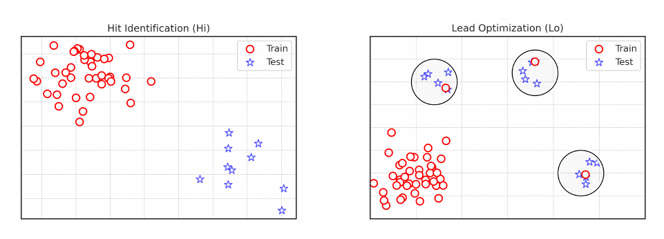

# Lo-Hi Benchmark

## Overview
There are two different tasks in drug discovery: Lead optimization (Lo) and Hit identification (Hi). This benchmark allows to disentangle Drug Discovery process into two tasks and evaluate models for each task separately.

Paper: [Lo-Hi: Practical ML Drug Discovery Benchmark](https://arxiv.org/abs/2310.06399)

NeurIPS 2023 review: [OpenReview](https://openreview.net/forum?id=H2Yb28qGLV) (will be available soon)

Lo-Hi Splitter Library: [https://github.com/SteshinSS/lohi_splitter](https://github.com/SteshinSS/lohi_splitter)



### Hit Identification
The goal of the Hit Identification task is to find novel molecules that have desirable property, but are dissimilar from the molecules with known activity. There are four datasets simulating this scenario: `DRD2-Hi`, `HIV-Hi`, `KDR-Hi` and `Sol-Hi`. They are binary classification tasks such that the most similar molecules between train and test have ECFP4 Tanimoto similarity < 0.4.

- `data/hi/drd2` -- for DRD2-Hi
- `data/hi/hiv` -- for HIV-Hi
- `data/hi/kdr` -- for KDR-Hi
- `data/hi/sol` -- for Sol-Hi

There are three splits of the datasets. Use only the first split for the hyperparameter tuning. Train your model with the same hyperparameters for all the three splits and calculate mean metric.

Metric: PR AUC.

### Lead Optimization
The goal of the Lead Optimization task is to predict how minor modifications of a molecule affect its activity. There are three datasets simulating this scenario: `DRD2-Lo`, `KCNH2-Lo` and more challenging `KDR-Lo`. They are ranking tasks that have clusters in the test set, so that the molecules in each clusters are quite similar with Tanimoto similarity > 0.4 to the central molecules, and each cluster has one similar molecule in the train set, representing known hit. 

- `data/lo/drd2` -- for DRD2-Lo
- `data/lo/kcnh2` -- for KCNH2-Lo
- `data/lo/kdr` -- for KDR-Lo

There are three splits of the datasets. Use only the first split for the hyperparameter tuning. Train your model with the same hyperparameters for all the three splits and calculate mean metric.

Metric: spearman correlation is calculated for each cluster in the test set and the mean is taken.

## Paper reproduction
This repository also contains code associated with the "Lo-Hi: Practical ML Drug Discovery Benchmark" paper. If you want to reproduce the initial data preprocessing, download the ChEMBL30 subset and save it to `data/raw/chembl30_slice.csv`.

Link: [https://drive.google.com/file/d/1QXFkgwmZoeONcCZT9MBAdW1qfv7wXWn-/view?usp=sharing](https://drive.google.com/file/d/1QXFkgwmZoeONcCZT9MBAdW1qfv7wXWn-/view?usp=sharing).

### Repository
This repository contains code for the dataset preparation and for the related paper. The `predictions` folder has predictions by different models -- each in its own subfolder. Those predictions are collected in the `notebooks/evaluations` notebooks.

```
- code:          common functions in .py modules
- data:          the datasets
  - hi:          Hi datasets
  - lo:          Lo datasets
  - raw:         source and intermediate datasets
- notebooks: 
  - data:        datasets preparation
  - evaluations: notebooks that evaluates models' predictions from the predictions folder
  - models:      notebooks that train models and make predictions
  - paper:       other notebooks, e.g. that render plots for the paper
- predictions:   contains predictions of different models. This folder is summarized in notebooks/evaluations notebooks.
```

### Installation
```
conda create --name lohi_benchmark python=3.10 -y
conda activate lohi_benchmark
pip install -r requirements.txt
```

### Adding packages
```
# Add new packages into requirements.in
conda activate lohi_benchmark
pip-compile requirements.in
pip-sync requirements.txt
```

### Chemprop and Graphormer
In the paper, both Chemprop and Graphormer were benchmarked. However, these are stand-alone software packages with conflicting dependencies, which is why they have not been included in this repository. Nonetheless, notebooks detailing hyperparameter tuning for Chemprop can be found at `notebooks/models/*/*/09_chemprop.ipynb`. To execute them, you will need a separate environment with the following dependencies:
```
chemprop==1.6.0 
descriptastorus==2.6.0
deepchem==2.7.1
``` 
Please adhere to these specific versions, as the latest versions may have conflicts.

## Citation
```
@inproceedings{steshin2023hi,
  title={Lo-Hi: Practical ML Drug Discovery Benchmark},
  author={Steshin, Simon},
  booktitle={Thirty-seventh Conference on Neural Information Processing Systems Datasets and Benchmarks Track},
  year={2023}
}
```